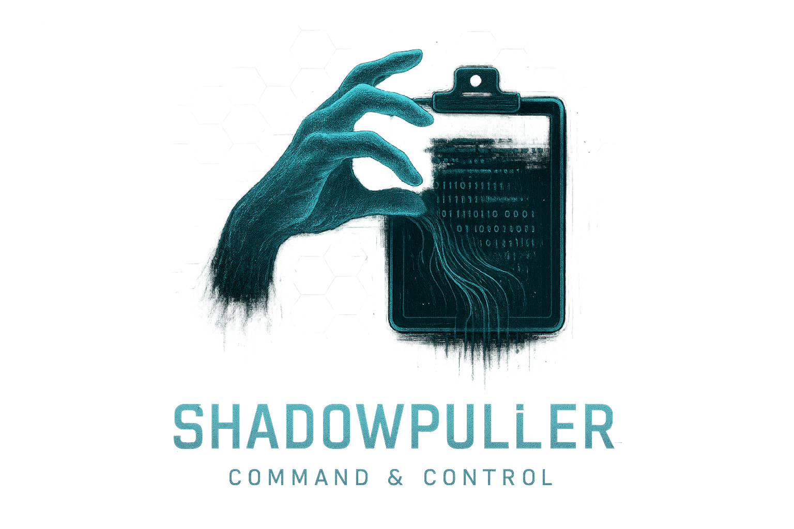
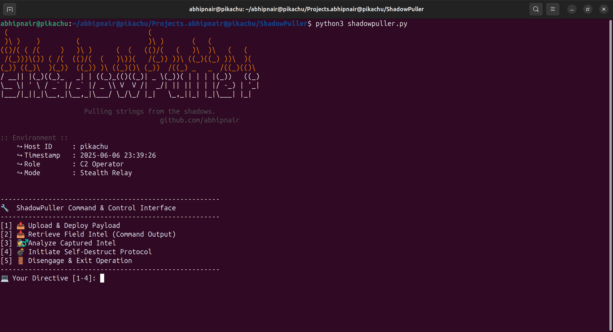
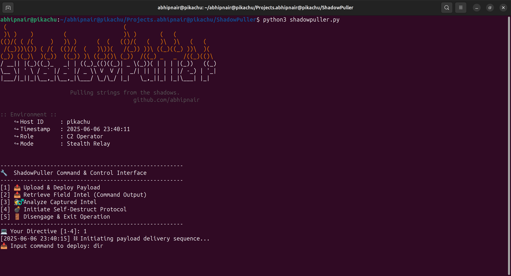
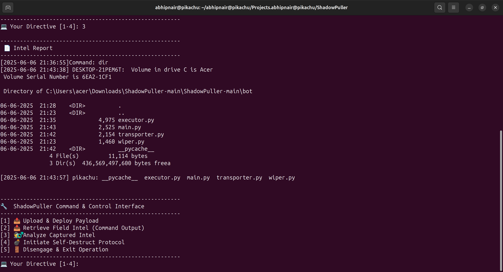
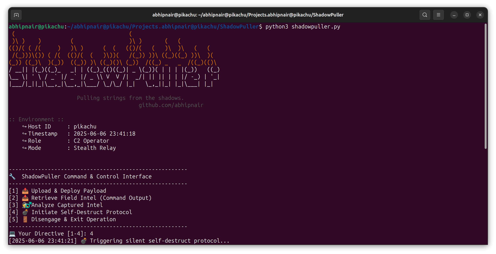

# 🔥 ShadowPuller - Stealth Command & Control Framework

--- 
## 🌑 Introduction

ShadowPuller is an advanced, stealthy Command & Control (C2) framework designed for covert operations on Windows and Linux. It uses obfucated(encoded) clipboard-based communication via a pastebin service to avoid direct network traces.

### Core advantages:

    Clipboard-based data exfiltration and command injection

    Base64 encoded commands/outputs for obfuscation

    Anti-forensics secure wiping & process termination

    Sandbox and debugger evasion techniques

    Cross-platform stealth command execution

---

## ⚙️ Architecture & Components

    shadowpuller/
    ├── bot/                    # Implant on target
    │   ├── executor.py         # Stealth command execution engine
    |   ├── main.py             # Main bot logic
    │   ├── transporter.py      # Clipboard comms & data exfiltration
    │   └── wiper.py            # Secure wipe & self-destruct
    │
    ├── attacker/               # Operator interface
    │   ├── output_parser.py    # Base64 decoder & output formatter
    │   └── attacker.py         # Push/fetch commands logic
    │
    ├── shadowpuller.py         # C2 Terminal CLI interface
    ├── requirements.txt
    └── README.md

---

## 🛠️ Installation

### Prerequisites
**1. Python 3.8+**
**2. Install dependencies:**

    pip install -r requirements.txt

---

## 🕵️‍♂️ Operational Guide
### 1. Deployment

    Add the klipit clipboard url in attacker and bot in desired positions

    Compile bot payload (using PyInstaller/Nuitka & UPX recommended)

    Deliver via preferred vector (email, USB, social engineering, etc.)

    Bot automatically starts clipboard-based comms with C2

### 2. Using ShadowPuller Terminal (C2 Operator Interface)

    python3 shadowpuller.py

### Commands Overview:
| Option                     | Description                            |
| -------------------------- | -------------------------------------- |
| 1. Upload & Deploy Payload | Push command payloads to infected host |
| 2. Retrieve Field Intel    | Fetch and decode Base64 encoded command outputs   |
| 3. Analyze Captured Intel  | Display collected data in the terminal       |
| 4. Initiate Self-Destruct  | Trigger secure wipe & cleanup on bot   |
| 5. Disengage               | Exit the interface cleanly             |

---

🔐 Security & Stealth Features
Clipboard Communication

    Commands and results are Base64 encoded

    Clipboard data pushed/pulled via private pastebin klipit.in for stealth

Stealth Execution

    Windows: ctypes-based in-memory command execution (no visible processes)

    Linux: syscall level execve/fork/pipe for stealth execution

Sandbox & Debugger Evasion

    Detects VM environments: VMWare, VirtualBox, QEMU

    Checks for debuggers/tools: Wireshark, ProcMon, IDA Pro

    Monitors system uptime, CPU cores, RAM size for sandbox fingerprinting

    Time-based execution to avoid sandbox auto-run

Self-Destruct & Anti-Forensics

    Multi-pass secure file wiping

    Terminates processes to avoid memory dumps

    Removes all traces of bot & logs

---

## Why ShadowPuller Can Be Used

### Covert Remote Control of Systems
**Enables stealthy command execution on compromised hosts without triggering network-based detections.**

### Bypass Traditional Network Monitoring
**Uses clipboard and pastebin channels instead of direct socket connections, evading firewall and IDS/IPS detection.**

### Advanced Anti-Forensics
**Self-destruct mechanisms securely erase traces to thwart forensic investigations.**

### Sandbox and VM Evasion
**Detects virtualized environments and debuggers to avoid analysis in automated malware sandboxes.**

### Cross-Platform Support
**Runs on Windows and Linux with native stealth techniques suited to each OS.**

### Flexible Command & Control Channels
**Uses innocuous pastebin services for command delivery and output exfiltration, blending in with normal traffic.**

### Adaptability for Penetration Testing
**Can be used by red teams for authorized engagements to test enterprise detection capabilities.**

---

## 🛡️ Obfuscation & Packing Recommendations
### Code Obfuscation

    Use PyArmor for bytecode obfuscation & anti-debugging

    Optionally implement custom Base64 + XOR encoding of code

### Binary Packing

    Compile with PyInstaller + UPX (--onefile --noconsole) for standalone stealth binary

    Or use Nuitka for Python to C compilation (harder to reverse engineer)

---

## 🚩 Troubleshooting & Tips

| Issue                             | Solution                                               |
| --------------------------------- | ------------------------------------------------------ |
| Bot not communicating             | Verify internet connectivity & klipit.in accessibility |
| Commands not executing stealthily | Check ctypes permissions or syscall implementation     |
| Pastebin service blocked          | Switch to alternate private pastebins or self-hosted   |
| Output not decoding correctly     | Confirm Base64 encoding/decoding integrity             |
| Sandbox detection false positive  | Tune threshold of CPU cores, RAM, uptime checks        |

## 📚 Contribution Guidelines

    Fork the repo & create feature branches

    Follow PEP8 Python style guide

    Include unit tests for new modules

    Submit pull requests with detailed descriptions

    Report bugs or request features via issues

---

## ⚠️ Legal Disclaimer

**ShadowPuller is intended strictly for educational, authorized penetration testing, and research purposes only. Misuse for unauthorized hacking or illegal activities is prohibited and punishable by law. The authors disclaim all liability for damages.**

---

🔗 Useful Tools & References

    PyArmor — Python code obfuscator

    Nuitka — Python to C compiler

    UPX — Executable packer

    Oxyry Python Obfuscator — Online obfuscation tool

    Klipit Pastebin — Private paste service

## 📷 Screenshots

### Shadowpuller Control CLI

### Payload Delivery using CLI

### Report in CLI

### Self-Destruction Protocol Starting

### Exit Banner and Self-Destruction

# Thank you for using ShadowPuller!

Use responsibly, stay stealthy. 🚨
